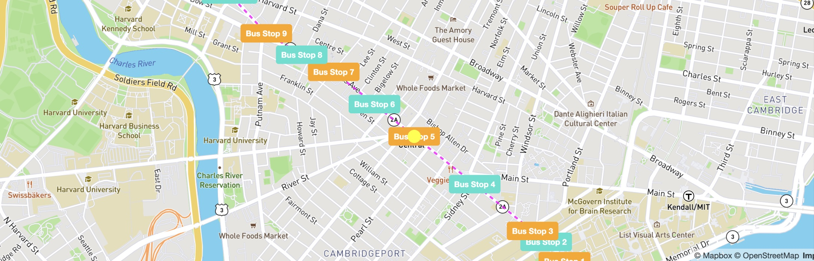

# Real-Time-Bus-Tracker

**Descripción:** Este proyecto refleja un mapa del área de Boston/Cambridge y una de las rutas de autobús que está disponible en el área. El proyecto inicial era agregar un marcador al mapa. Ahora hice ese mercado amarillo (color del autobús), agregué la ruta como magenta y codifiqué con colores cada parada de autobús en el camino por el que pasará el marcador amarillo.

**Futuras mejoras:** En el futuro me gustaría actualizar este código para tener una imagen de un autobús siguiendo la ruta. Otra mejora que creo que sería útil es que aparezcan los tiempos de la ruta cuando el autobús llega a la parada.

**Ejecutando el código:** Para ejecutar el código, debe abrir el archivo html y verá un círculo amarillo que se mueve a lo largo de la ruta del autobús que va del MIT a Harvard.
